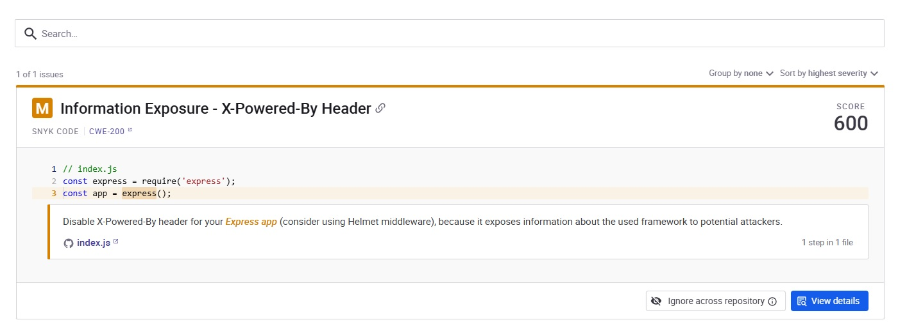
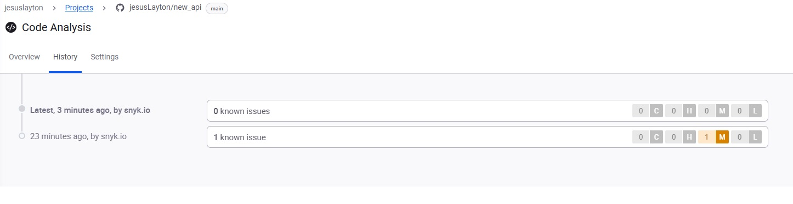

# 🌐 Simple Node.js API – Deploy en Render


Esta es una API básica desarrollada con **Node.js** y **Express**, desplegada en [Render.com](https://render.com).  
Sirve como ejemplo para iniciar proyectos backend, comprender la estructura de una API REST y cómo hacer un despliegue gratuito en la nube.

**🛡️ Seguridad:** Este proyecto implementa medidas de seguridad actualizadas y ha solucionado vulnerabilidades conocidas.

---

## 🚀 Enlace en producción
🔗 **API URL:** [https://new-api-5g3h.onrender.com](https://new-api-5g3h.onrender.com)

⚠️ **Nota sobre Render (Plan Gratuito):**
- El servicio puede tardar **30-60 segundos** en despertar si ha estado inactivo
- Si no responde, espera un momento y recarga la página
- Las apps gratuitas se duermen después de 15 minutos de inactividad

### 🧪 Endpoints para probar:

| Endpoint | URL Completa | Descripción |
|----------|--------------|-------------|
| **Mensaje principal** | [/](https://new-api-5g3h.onrender.com/) | Saludo de la API |
| **Lista de usuarios** | [/usuarios](https://new-api-5g3h.onrender.com/usuarios) | JSON con datos simulados |

**Alternativamente, usa cURL:**
```bash
# Endpoint principal
curl https://new-api-5g3h.onrender.com/

# Endpoint de usuarios
curl https://new-api-5g3h.onrender.com/usuarios
```

---

## 📂 Estructura del proyecto

├── index.js
├── package.json
├── package-lock.json
├── .gitignore
└── README.md


---

## 🧠 Endpoints disponibles

| Método | Ruta        | Descripción                  |
|--------|-------------|------------------------------|
| GET    | `/`         | Devuelve un mensaje simple   |
| GET    | `/usuarios` | Lista de usuarios simulados  |

---

## ⚙️ Cómo ejecutarlo localmente

1. **Clona este repositorio:**
   ```bash
   git clone https://github.com/tu-usuario/new_api.git
   cd new_api
   ```

2. **Instala las dependencias:**
   ```bash
   npm install
   ```

3. **Ejecuta el servidor:**
   ```bash
   node index.js
   ```

El servidor se iniciará en: **http://localhost:3000**

---

## 🔧 Solución de problemas

### 🌐 Si la API en Render no responde:

1. **Espera 30-60 segundos** - El servicio gratuito puede estar "dormido"
2. **Recarga la página** varias veces
3. **Verifica el badge de estado** arriba (🟢 online / 🔴 offline)
4. **Ejecuta localmente** siguiendo las instrucciones anteriores

### 🔍 Verificar estado manualmente:
```bash
# Test de conectividad
ping new-api-5g3h.onrender.com

# Test HTTP
curl -I https://new-api-5g3h.onrender.com/
```

---

## 🛡️ Seguridad implementada

### ✅ Vulnerabilidades solucionadas

| Vulnerabilidad | Código | Estado | Solución |
|----------------|--------|---------|----------|
| Information Exposure - X-Powered-By Header | CWE-200 | ✅ **FIXED** | `app.disable('x-powered-by')` |

**📸 Evidencia de resolución:**

| Antes | Después |
|-------|---------|
|  |  |
| *Vulnerabilidad CWE-200 detectada por Snyk Code* | *Historial de Snyk mostrando 0 vulnerabilidades* |

**🔍 Proceso de resolución:**
1. ✅ **Detección** - Snyk identificó la exposición del header X-Powered-By
2. ✅ **Implementación** - Agregamos `app.disable('x-powered-by')` en el código
3. ✅ **Verificación** - Snyk confirma que no hay vulnerabilidades restantes

### 🔒 Medidas de seguridad aplicadas

- ✅ **Header X-Powered-By deshabilitado** - Previene exposición de información del framework
- ✅ **Middleware JSON habilitado** - Parsing seguro de datos JSON
- ✅ **Estructura REST básica** - Endpoints organizados y documentados

> **Nota:** Esta API sigue las mejores prácticas de seguridad recomendadas para aplicaciones Node.js/Express en producción.

---

## 📝 Contribuciones

¿Encontraste algún problema o tienes una sugerencia? ¡Abre un issue o envía un pull request!

## 📄 Licencia

Este proyecto está bajo la Licencia MIT - ver el archivo LICENSE para más detalles.